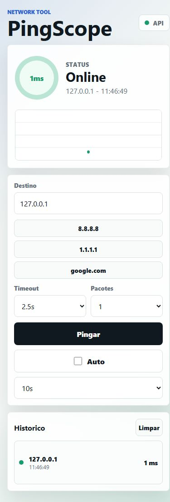

# PingScope

Ferramenta para testar se um IP ou dominio responde a ping, com backend Node.js,
interface web mobile-first/PWA e base de app mobile em Expo.



## Funcionalidades

- Teste de IP ou dominio por ping real do sistema.
- Status online/offline.
- Latencia aproximada em ms.
- Historico dos ultimos testes.
- Modo automatico com intervalo configuravel.
- Interface web responsiva instalavel como PWA.
- App mobile Expo consumindo a mesma API.

## Estrutura

```text
pingscope/
  server.mjs
  package.json
  public/
    index.html
    styles.css
    app.js
    manifest.webmanifest
    sw.js
  mobile/
    App.js
    package.json
    app.json
```

## Rodar a versao web/PWA

```bash
npm start
```

Depois abra:

```text
http://localhost:4173
```

Para usar pelo celular na mesma rede Wi-Fi, rode o servidor e abra no celular a
URL de rede exibida no terminal, parecida com:

```text
http://192.168.0.10:4173
```

## API

```http
POST /api/ping
content-type: application/json

{
  "target": "8.8.8.8",
  "timeoutMs": 2500,
  "count": 1
}
```

## App mobile Expo

O codigo do app mobile esta em `mobile/`.

```bash
cd mobile
npm install
npm start
```

No celular, coloque no campo `Servidor` a URL de rede do backend, por exemplo
`http://192.168.0.10:4173`.

## Observacao tecnica

Navegadores e apps mobile comuns nao fazem ICMP ping direto de forma confiavel.
Por isso o backend faz o ping e o app so consome a API.
